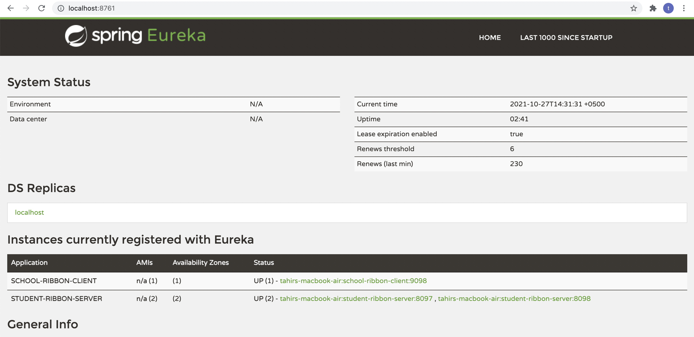
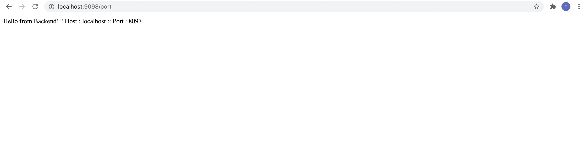

# Discovery Service Example Project with Eureka

Three microservices for this Netflix Eureka and Ribbon example.

 - Eureka Service Registry Server microservice provides the service registry and discovery server.
 - Student Ribbon Server microservice which gives some functionality based on Student entity. It is a rest based service and most importantly it is a eureka client service, which will talk with eureka service to register itself in the service registry, as well as ribbon server
 - School Ribbon Client microservice is a eureka client service which call another eureka client and a ribbon client which returns the port of ribbon server

## Technology Stack Requirements

 - Java 11, Intellij IDEA, Maven as Development Environment
 - Spring-boot and Cloud as application framework
 - Eureka as Service registry Server
 - Ribbon as Client Side Load balancer

## Dependencies

```sh
<dependency>
    <groupId>org.springframework.cloud</groupId>
    <artifactId>spring-cloud-starter-netflix-eureka-server</artifactId>
</dependency>

<dependency>
    <groupId>org.springframework.cloud</groupId>
    <artifactId>spring-cloud-starter-netflix-ribbon</artifactId>
</dependency>
```

## Run applications

To do the final build, use command `mvn clean install` and check if the build is successful. If there is any error you need to fix those to proceed. Once we have successful build for all the maven projects, we will start the services one by one.

Eureka first, then the ribbon server and finally the ribbon client.

To start each microservice, we will use `java -jar -Dserver.port=XXXX target/YYYYY.jar` command.

To deploy multiple instances of ribbon server we need to use different port for this, to start service in a specific port we need to pass the port in this way.
`java -jar -Dserver.port=XXXX target/YYYYY.jar`. We will create 3 instances of this service in ports 9090, 9091 and 9092 ports.

## Verify Eureka Server

Now go to `http://localhost:8761/` in browser and check that eureka server is running with all microservices are registed with desired number of instances.




## Test Eureka Client / Ribbon Server

We will now verify that the `/student-details-for-school/{schoolname}` endpoint is up and running. Go to browser and go to `http://localhost:8098/student-details-for-school/school1`, it will give the Student details for a particular school school1.

## Test Ribbon Client

Now test the client url. You will get response from the registered instances only. Now if you start new instance of backend microservice in different port, Ribbon will not send request to the new instance until we register that manually in the ribbon.
Open the client microservice rest endpoint `http://localhost:9098/port` and see that response is coming from any one of the backend instance.


